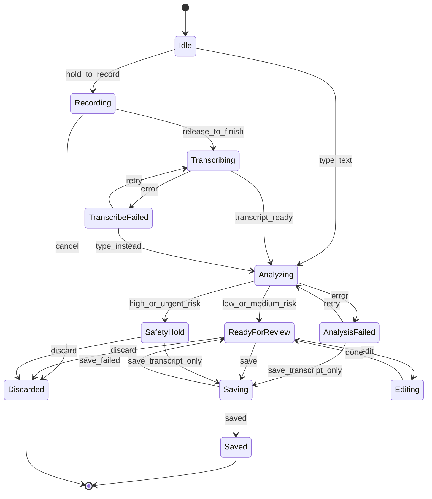

# 心迹Mood MVP Data Contract

Status: locked for MVP implementation draft  
Last updated: 2026-06-12

This document is the source of truth for the first 心迹Mood data model and the
`draft -> review -> save` flow. The MVP should optimize for one proof point:

> A user can record a 30-second voice note, review what was heard, and receive a
> Pattern Card that feels accurate, explainable, and useful.

## Product Invariants

- Voice input creates a **draft**, not a saved check-in.
- Users review or edit the transcript before a check-in is saved.
- Raw audio is not saved by default. It is used for transcription, then deleted
  after processing unless a future explicit user setting says otherwise.
- AI analysis is never treated as diagnosis. It is a wellness reflection aid.
- A Pattern Card must expose enough evidence for the user to understand why it
  was generated.
- Users can correct the transcript, reject a pattern, and rate whether a micro
  action helped.
- Weekly reports are derived only from saved check-ins, confirmed pattern data,
  and action feedback.
- Every persisted root entity has `schemaVersion` so local SQLite data can be
  migrated safely.

## MVP State Flow



## Draft Status Contract

Use this exact draft status set in the frontend reducer and backend draft API:

- `recording`
- `transcribing`
- `transcribe_failed`
- `analyzing`
- `analysis_failed`
- `ready_for_review`
- `editing`
- `safety_hold`
- `saving`
- `saved`
- `discarded`

Legal transitions are encoded in `DRAFT_TRANSITIONS` in
[mvp-types.ts](mvp-types.ts). UI code should validate transitions so state does
not drift across recording, transcription, analysis, safety, and save paths.

Important fallback rule:

- If transcription fails, the user can retry, type instead, or discard.
- If AI analysis fails, the user can retry, save transcript-only, or discard.
- AI failure must not destroy the user's record.

## Chain Model

Pattern chains are the product's aggregation foundation. Never use plain
`string[]` for chains.

Each chain node has:

- `kind`: semantic role, such as `context`, `trigger`, `thought`, `emotion`,
  `body`, or `behavior`
- `key`: stable machine identifier used for aggregation and i18n, such as
  `work_feedback` or `stomach_tightness`
- `label`: display snapshot for the current locale
- `confidence`: 0-1 extraction confidence

`chainKey` is generated by joining ordered node keys:

```text
short_sleep>work_feedback>self_blame>rumination>stomach_tightness
```

Rules:

- `key` is the source of truth for statistics and matching.
- `label` is only display text and should not drive logic.
- MVP should use a fixed canonical key vocabulary first. If custom values are
  needed later, prefix them with `custom:`.
- `PatternCard.chainKey`, `PatternChainStats.chainKey`, and
  `WeeklyReportLoop.chainKey` must refer to the same normalized loop.

## Safety Contract

Risk assessment is a behavior contract, not a user-facing label.

AI analysis returns a `RiskAssessment`:

- `level`: `low | medium | high | urgent_medical`
- `signalKeys`: machine keys for the reason, without storing sensitive raw text
  in logs
- `confidence`
- `assessedAt`

The client maps `RiskAssessment.level` through `SAFETY_DIRECTIVES`:

| Risk level | Show Pattern Card | Recommend action | Support surface | Save allowed |
| --- | --- | --- | --- | --- |
| `low` | yes | yes | none | yes |
| `medium` | yes | yes | gentle note | yes |
| `high` | no | no | resources panel | yes |
| `urgent_medical` | no | no | medical note | yes |

Rules:

- High or urgent risk should enter `safety_hold`.
- `safety_hold` can still save the user's transcript. Data belongs to the user.
- High or urgent risk should save transcript plus risk assessment only; avoid
  saving unreliable emotional attribution into long-term pattern data.
- The app should not let the LLM decide support copy freely. Client behavior is
  determined by static `SAFETY_DIRECTIVES`.
- If AI parsing fails, treat the safety state as at least `medium` until a retry
  succeeds or the user saves transcript-only.

## Core Objects

### UserPrivacyState

Tracks user-controlled data and AI behavior.

Required fields:

- `schemaVersion`
- `localModeEnabled`
- `cloudSyncEnabled`
- `saveRawAudioEnabled`
- `allowModelImprovement`
- `aiProcessingEnabled`
- `transcriptRetentionDays`
- `dataRetentionDays`
- `exportRequestedAt`
- `deleteRequestedAt`
- `locale`

MVP defaults:

- `localModeEnabled`: true
- `cloudSyncEnabled`: false
- `saveRawAudioEnabled`: false
- `allowModelImprovement`: false
- `aiProcessingEnabled`: true
- `locale`: `en-US`

### CheckInDraft

Temporary object created after voice or text input and before user save.

Required fields:

- `schemaVersion`
- `id`
- `createdAt`
- `updatedAt`
- `status`
- `source`: `voice | text`
- `recordingSessionId`
- `localAudioUri`
- `transcriptReview`
- `patternAnalysis`
- `patternCard`
- `recommendedAction`
- `riskAssessment`
- `lastError`
- `privacySnapshot`

Rules:

- Drafts may be stored locally for crash recovery, but they must be visually
  separate from saved check-ins.
- `localAudioUri` is local-only and must be deleted when a draft reaches `saved`
  or `discarded`, unless the user explicitly enabled raw audio saving in a
  future setting.
- Save is blocked while a draft is recording, transcribing, analyzing, already
  saving, discarded, or missing transcript review.

### TranscriptReview

Captures what the user approved before analysis or save.

Required fields:

- `originalText`
- `editedText`
- `language`
- `confidence`
- `reviewStatus`: `pending | confirmed | edited | rejected`
- `confirmedAt`

Rules:

- Analysis should run on `editedText` when present.
- Save is blocked until the transcript is confirmed or edited by the user.
- If the user rejects the transcript, the draft returns to recording or text
  input.

### PatternAnalysis

Internal structured AI result. This powers the Pattern Card but is not the same
as the user-facing card.

Required fields:

- `schemaVersion`
- `id`
- `checkInDraftId`
- `checkInId`
- `model`
- `analyzedAt`
- `inputText`
- `emotions`
- `bodySignals`
- `triggers`
- `thoughtPatterns`
- `behaviors`
- `sleepSignals`
- `intensity`: `light | medium | strong`
- `confidence`
- `evidence`
- `riskAssessment`
- `possiblePatternChain`

Rules:

- `confidence` is a 0-1 score for the whole analysis.
- Each extracted signal should include a stable `key`, display `label`, and
  confidence.
- `riskAssessment` is not displayed as a normal insight. It drives client safety
  behavior.

### PatternCard

User-facing explanation card. This is the core product artifact.

Required fields:

- `schemaVersion`
- `id`
- `chainKey`
- `sourceCheckInIds`
- `title`
- `summary`
- `chain`
- `whyWeThinkThis`
- `confidenceLabel`
- `similarPastCheckInIds`
- `microActionId`
- `feedback`

Rules:

- The card must show a readable chain, for example:
  `Short sleep -> Work feedback -> Self-blame -> Overthinking -> Stomach tightness`.
- `whyWeThinkThis` should cite user wording or extracted signals in plain
  language.
- `confidenceLabel` should be product language, not a raw score:
  `strong signal | possible pattern | needs more entries`.
- The card must include a feedback entry point:
  `Feels right | Not quite`.
- `sourceCheckInIds` powers "Based on N check-ins" and lets users inspect where
  an insight came from.

### SavedCheckIn

The official user record after confirmation.

Required fields:

- `schemaVersion`
- `id`
- `createdAt`
- `savedAt`
- `source`
- `finalText`
- `transcriptReview`
- `patternAnalysis`
- `patternCard`
- `recommendedAction`
- `riskAssessment`
- `privacySnapshot`

Rules:

- Saved check-ins are the only records that feed Patterns and Weekly Report.
- A high or urgent safety record may have `patternAnalysis`, `patternCard`, and
  `recommendedAction` set to null.
- Updating `finalText` after save should create a new analysis draft or mark the
  previous analysis as stale.

### UserPatternFeedback

Feedback that improves future pattern detection.

Required fields:

- `schemaVersion`
- `patternCardId`
- `checkInId`
- `rating`: `feels_right | not_quite | wrong`
- `correctedChain`
- `notes`
- `createdAt`

MVP behavior:

- `Feels right` strengthens future similarity matching.
- `Not quite` opens a lightweight correction prompt or free-text note.
- `Wrong` excludes the card from weekly report aggregation unless the user saves
  a correction.

### MicroActionRecommendation

The action suggested from a Pattern Card.

Required fields:

- `schemaVersion`
- `id`
- `checkInId`
- `patternCardId`
- `actionId`
- `reason`
- `estimatedMinutes`
- `status`: `offered | started | completed | skipped`
- `createdAt`

Rules:

- Micro actions are not a generic library in the first-use flow. They are
  recommended because of a specific pattern.
- `reason` must explain the mapping, for example:
  `Recommended because this pattern includes feedback, self-blame, and overthinking.`
- Do not recommend an action when `SAFETY_DIRECTIVES[level].recommendAction` is
  false.
- Do not recommend an action whose contraindication keys match risk signals.

### MicroActionCompletion

Captures whether the recommended action was completed, skipped, and whether it
helped. Completion, helpfulness, effort, and skip reason are separate signals.

Required fields:

- `schemaVersion`
- `recommendationId`
- `actionId`
- `completedAt`
- `completionStatus`: `completed | skipped`
- `helpfulness`: `helped | helped_a_little | did_not_help | null`
- `effort`: `easy | okay | too_much | null`
- `skipReason`: `not_today | not_relevant | no_time | null`
- `notes`

Rules:

- `Not today` maps to `completionStatus: skipped` and
  `skipReason: not_today`; it is not `did_not_help`.
- Weekly Report should use `helpfulness` to highlight which actions worked.
- Future recommendations should prefer actions that helped and avoid actions
  repeatedly marked `too_much` or `did_not_help`, while treating skips as
  scheduling/context feedback rather than failure.

### PatternChainStats

Aggregated data source for Patterns and Weekly Report. This is computed from
saved check-ins; it is not directly generated by AI.

Required fields:

- `schemaVersion`
- `chainKey`
- `chain`
- `windowStart`
- `windowEnd`
- `occurrenceCount`
- `sourceCheckInIds`
- `lastSeenAt`
- `topTriggers`
- `topBodySignals`
- `intensityBreakdown`
- `feedbackSummary`
- `actionEffectiveness`
- `trend`
- `computedAt`

MVP rule:

- Start with weekly aggregation. A 4-week rolling trend can be added later.
- `feedbackSummary` should align with user feedback: `feelsRight`, `notQuite`,
  and `wrong`.

### WeeklyReport

Generated from saved check-ins and action feedback.

Required fields:

- `schemaVersion`
- `id`
- `weekStart`
- `weekEnd`
- `generatedAt`
- `status`
- `mainLoops`
- `topBodySignals`
- `topTriggers`
- `actionsThatHelped`
- `nextWeekFocus`
- `sourceCheckInIds`

Rules:

- Weekly reports must not use discarded drafts.
- A report can be shown as `not_enough_data` until the user has enough saved
  check-ins.
- MVP threshold: show a lightweight report after 3 saved check-ins in a week.
- Weekly report loops should be snapshots of `PatternChainStats`, not a second
  independent aggregation system.

## API Contract

The implementation can use one backend route internally, but the product
contract must preserve these steps.

### `POST /check-ins/transcribe`

Purpose: Convert ephemeral audio into text.

Input:

- audio file/blob
- locale
- privacy snapshot

Output:

- `recordingSession`
- `transcriptReview`
- `draftId`

Important: This endpoint creates or updates a draft. It does not create a saved
check-in.

### `POST /check-ins/:draftId/analyze`

Purpose: Generate a draft Pattern Card from confirmed or edited transcript text.

Input:

- `editedText` or confirmed transcript text
- optional selected emotion/body chips

Output:

- `riskAssessment`
- `patternAnalysis`
- `patternCard`
- `recommendedAction`
- `safetyDirective`

Rules:

- `high` or `urgent_medical` can return null `patternCard` and null
  `recommendedAction`.
- Analysis failures may return no card but should preserve the transcript draft.

### `POST /check-ins/:draftId/save`

Purpose: Convert a reviewed draft into a saved check-in.

Input:

- confirmed transcript
- accepted or edited Pattern Card, unless the draft is in `safety_hold` or
  transcript-only fallback
- optional initial pattern feedback

Output:

- `savedCheckIn`

Save is blocked when:

- transcript review is pending
- draft is recording, transcribing, analyzing, discarded, or already saving

Save is allowed when:

- draft is in `safety_hold` and transcript review is complete
- AI analysis failed but the user chooses transcript-only save

### `POST /check-ins/:checkInId/pattern-feedback`

Purpose: Capture whether the Pattern Card felt right.

Input:

- `rating`
- optional corrected chain
- optional notes

Output:

- updated `PatternCard.feedback`

### `POST /micro-actions/:recommendationId/complete`

Purpose: Capture action completion and helpfulness.

Input:

- completion status
- helpfulness
- effort
- optional notes

Output:

- `MicroActionCompletion`

### Read APIs

- `GET /check-ins/recent`
- `GET /patterns`
- `GET /weekly-report?weekStart=YYYY-MM-DD`
- `GET /privacy-state`

## Frontend Screen Flow

### Today

Primary action:

- Bottom thumb-zone voice control: `Hold to record`
- Optional small keyboard fallback: text input

States:

- idle
- recording
- transcribing
- transcribe failed
- analyzing
- analysis failed
- ready for review
- editing
- safety hold
- saving
- saved
- discarded

### Transcript Review

Required UI:

- `What we heard`
- editable transcript
- `Looks right`
- `Edit`
- privacy note: `Audio is deleted after transcription. You control what gets saved.`

### Pattern Review

Required UI:

- pattern chain
- why we think this
- confidence label
- `Feels right`
- `Not quite`
- `Save`

### Safety Hold

Required UI:

- calm, non-diagnostic support surface from `SafetyDirective.support`
- option to save transcript
- option to discard
- no Pattern Card and no recommended micro action for high or urgent risk

### Actions

Required UI:

- recommended action from the current pattern
- completion
- helpfulness feedback

### Patterns

Required UI:

- repeating loops from `PatternChainStats`
- body signal trend
- top triggers
- weekly report entry

## Day-One Build Priority

1. TypeScript models in the app codebase.
2. Mock draft lifecycle in local state.
3. Today voice flow using mocked transcript.
4. Transcript review before save.
5. Mock Pattern Card with `chainKey`, confidence, source IDs, and feedback.
6. Mock safety hold path for high risk.
7. Save only after user confirmation.

Everything else should serve this path.
